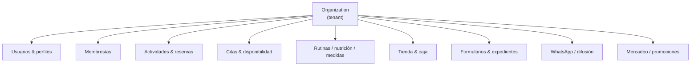
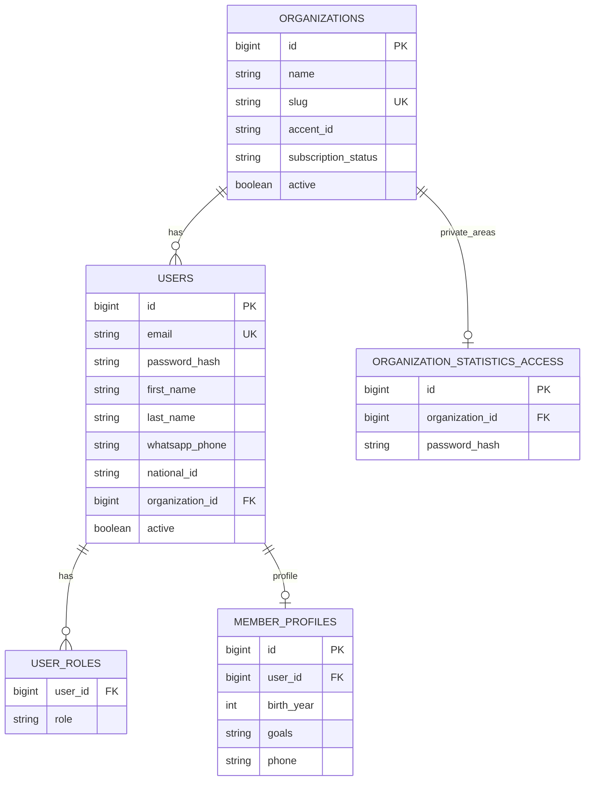
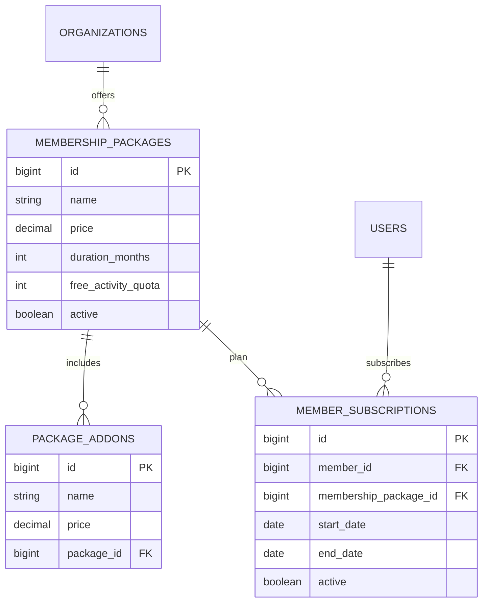
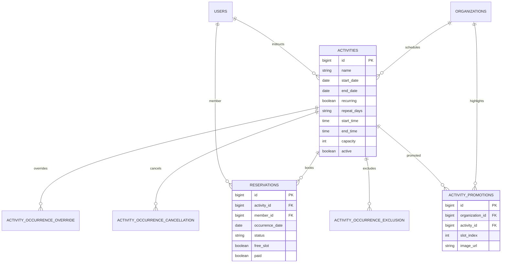
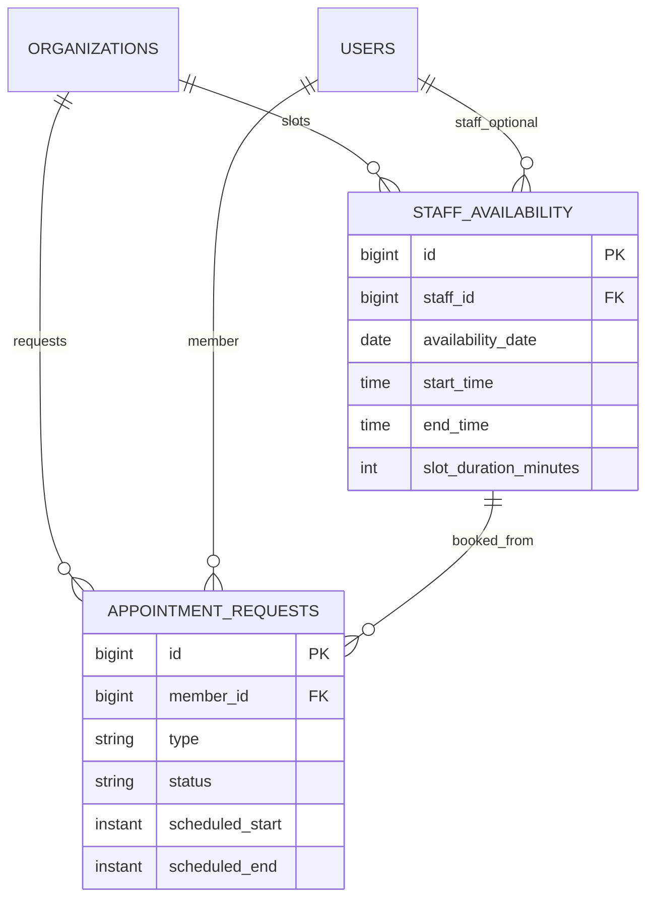
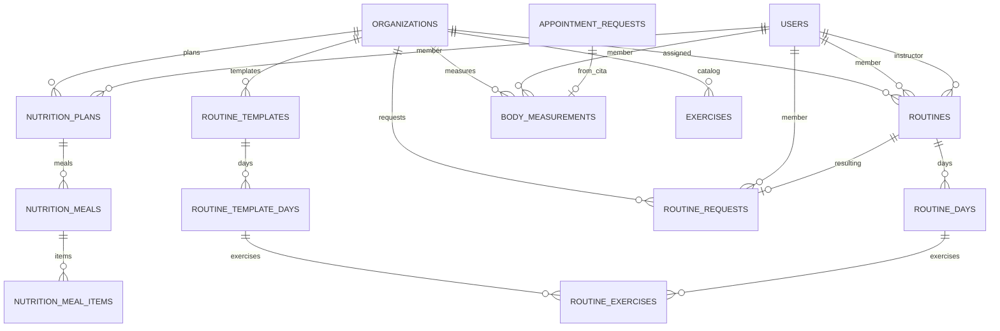
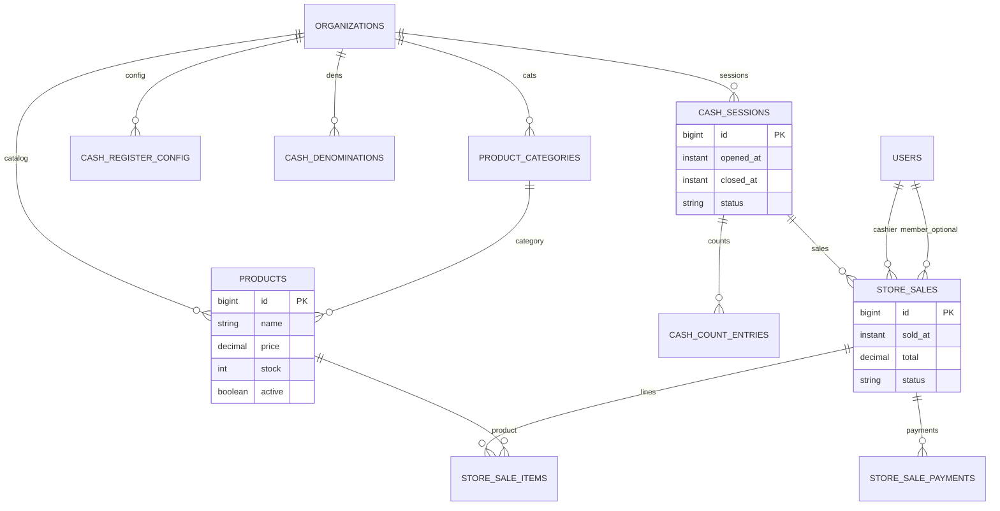
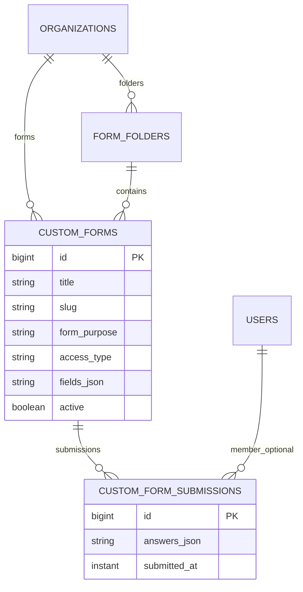
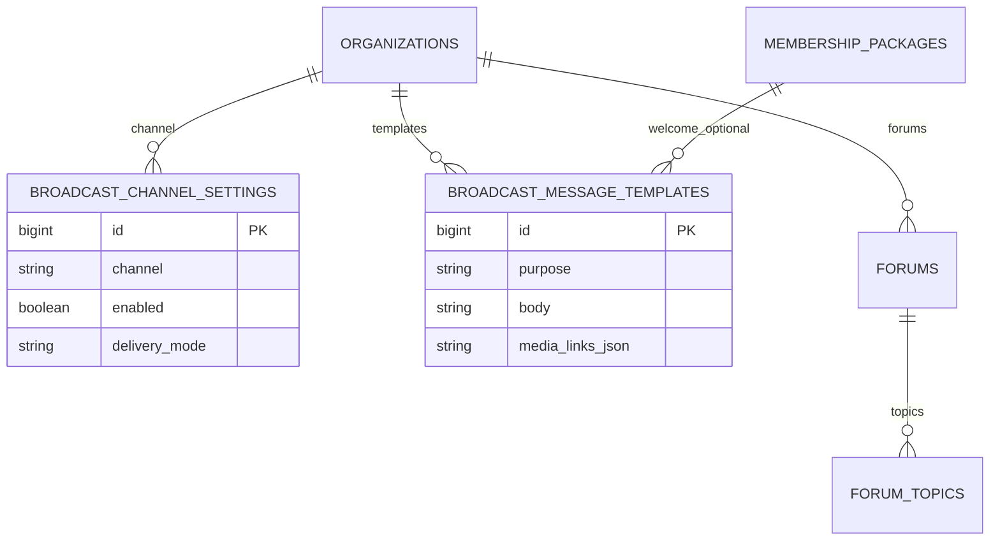

# Modelo de datos (ERD)

GymPlatform usa **JPA/Hibernate** sobre H2 (dev) o PostgreSQL (prod). El esquema se actualiza con `ddl-auto=update`. Este documento describe el modelo por **dominios** (más legible que un único diagrama con ~40 entidades).

> El producto opera sobre **una organización (gimnasio)**. Usuarios pertenecen a esa org.

---

## Diagrama de contexto (dominios)

---

## 1. Núcleo: organización y usuarios

**Roles** (`user_roles.role`): `GYM_OWNER` (Administrador), `RECEPTIONIST`, `INSTRUCTOR`, `MEMBER` (un usuario puede tener varios).

---

## 2. Membresías

---

## 3. Actividades, cupos y reservas

Notas:

- Las **ocurrencias** de clases recurrentes se expanden en código (`ActivityRecurrenceUtil`); overrides/cancelaciones ajustan fechas concretas.
- **Promociones**: hasta 3 slots (`slot_index` 1–3) para el carrusel del inicio del miembro.

---

## 4. Citas y disponibilidad de staff

Tipos típicos: `MEASUREMENT`, `NUTRITION`, `CONSULTATION`. Estados: `PENDING`, `SCHEDULED`, `COMPLETED`, `REJECTED`, etc.

---

## 5. Entrenamiento: rutinas, nutrición, medidas

---

## 6. Tienda, caja y ventas

---

## 7. Formularios, carpetas y expedientes

Los campos del formulario viven en **JSON** (`fields_json` / `answers_json`), no en tablas normalizadas por campo.

---

## 8. Difusión WhatsApp y foros

---

## Convenciones útiles para testing / improvements

| Tema | Convención actual |
|------|-------------------|
| IDs | `IDENTITY` / secuencias; seeds demo usan IDs fijos y luego `RESTART WITH 100` |
| Soft delete | Preferencia por `active` boolean en muchas entidades |
| Fechas | `LocalDate` / `LocalTime` para agenda; `Instant` para eventos/timestamps |
| Money | `BigDecimal` / decimal en JPA |
| Tenant filter | Siempre validar `organization_id` en servicios (no confiar solo en el front) |

---

## Inventario de entidades (Java)

Ubicación: `backend/src/main/java/com/gymplatform/domain/entity/`

| Dominio | Entidades |
|---------|-----------|
| Núcleo | `Organization`, `User`, `MemberProfile`, `OrganizationStatisticsAccess` |
| Membresía | `MembershipPackage`, `PackageAddon`, `MemberSubscription` |
| Actividades | `Activity`, `Reservation`, `ActivityOccurrence*`, `ActivityPromotion` |
| Citas | `StaffAvailability`, `AppointmentRequest` |
| Training | `Routine*`, `RoutineRequest`, `Exercise`, `Nutrition*`, `BodyMeasurement` |
| Tienda | `Product`, `ProductCategory`, `StoreSale*`, `Cash*` |
| Forms | `CustomForm`, `CustomFormSubmission`, `FormFolder` |
| Otros | `Broadcast*`, `Forum`, `ForumTopic` |

Para el esquema vivo en H2: consola http://localhost:8080/h2-console (JDBC URL del `application.properties`).
