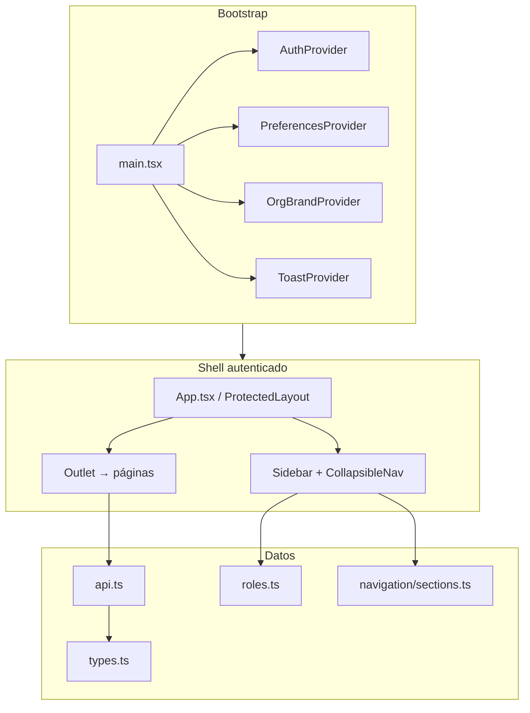
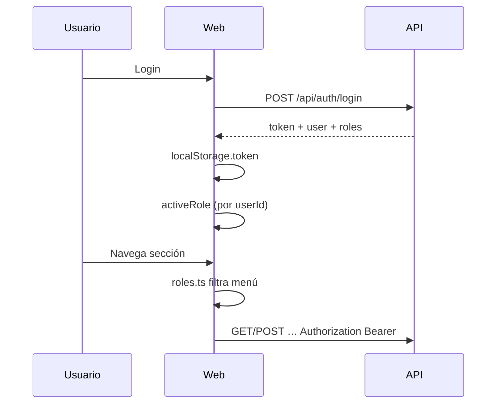
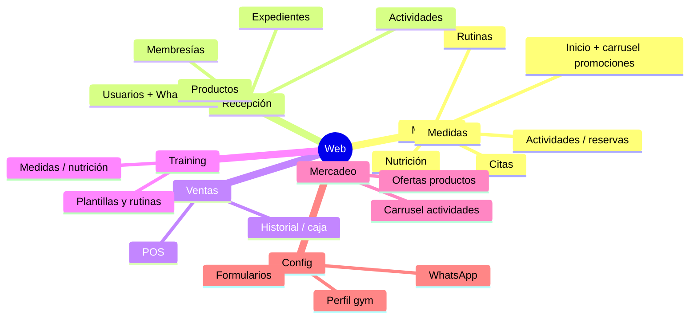

# Frontend (Web)

Documentación del panel web: React + TypeScript + Vite. Puerto local **5173**.

> Relacionado: [Tech Stack](Tech-Stack) · [Arquitectura](Architecture) · [Roles](Roles-and-Permissions) · [API](API-Reference)

---

## Stack frontend

| Pieza | Tecnología | Rol |
|-------|------------|-----|
| UI | **React 19** | Componentes / páginas |
| Lenguaje | **TypeScript ~5.7** | Tipado |
| Bundler / dev server | **Vite 6** | HMR, build, proxy |
| Routing | **React Router 7** | SPA + layouts |
| HTTP | `fetch` en `api.ts` | JWT en `localStorage` |
| Gráficas | **Recharts 3** | Estadísticas |
| PDF | **jsPDF 4** | Facturas, expedientes, QR |
| DnD | **@dnd-kit** | Builder de formularios / orden |
| Estilos | CSS global (`index.css`) | Variables de tema / marca |

No hay CSS-in-JS ni UI kit externo (Material, etc.): el diseño es custom.

---

## Cómo arrancar

```bash
cd web
npm install
npm run dev
```

| Script | Qué hace |
|--------|----------|
| `npm run dev` | Vite en http://localhost:5173 |
| `npm run build` | `tsc -b` + build producción |
| `npm run preview` | Sirve el build |

Requisito: API en `:8080` (proxy Vite).

### Proxy (`vite.config.ts`)

```
/api      → http://localhost:8080
/uploads  → http://localhost:8080
```

En producción, configurar `VITE_API_URL` o servir API detrás del mismo origen.

---

## Diagrama de la aplicación



---

## Estructura de carpetas

```
web/src/
├── main.tsx                 # entry
├── App.tsx                  # rutas + layout + nav
├── api.ts                   # cliente HTTP único
├── types.ts                 # DTOs / tipos de dominio
├── auth.tsx                 # sesión, login, rol activo
├── roles.ts                 # canView* + labels
├── theme.tsx / orgBrand.tsx # tema + marca del gym
├── toast.tsx                # notificaciones
├── index.css                # design system ligero
├── navigation/
│   └── sections.ts          # menús por área (recepción, miembro, …)
├── preferences/             # i18n ligero, formato fecha, escala UI
├── pages/                   # pantallas por dominio
│   ├── inicio/              # home miembro/staff, actividades, citas
│   ├── gym-admin/           # usuarios, paquetes
│   ├── reception/           # productos, actividades admin
│   ├── ventas/              # POS + historial
│   ├── estadisticas/
│   ├── training/            # rutinas, medidas, nutrición (staff)
│   ├── agenda/
│   ├── mercadeo/
│   ├── configuracion/
│   ├── expedientes/
│   └── …
├── components/              # UI reutilizable (calendarios, modales, …)
├── hooks/
└── utils/                   # fechas, WhatsApp, PDF, dinero, …
```

---

## Autenticación y roles



| Concepto | Dónde |
|----------|--------|
| Token JWT | `localStorage.token` |
| Usuario actual | `useAuth().user` |
| Rol activo (switch administrador multi-perfil) | `useAuth().activeRole` / `setActiveRole` |
| ¿Vista miembro? | `isMemberView(activeRole)` |
| Permisos de menú | `canViewReception`, `canViewVentas`, etc. en `roles.ts` |

El administrador demo (`admin@gymplatform.local`) tiene varios roles: al cambiar a **Miembro** se usa la misma cuenta/userId (no el de `miembro@gymplatform.local`).

---

## Cliente API (`api.ts`)

Patrones:

- Base: `VITE_API_URL` o `/api` en dev.
- Header `Authorization: Bearer <token>`.
- Errores → `ApiError` con mensaje en español (body `message` del backend).
- 401 → handler global (logout / re-login).

Convención: **toda** llamada de negocio pasa por `api.*`; no `fetch` suelto en páginas salvo casos excepcionales.

Tipos de respuesta alineados con `types.ts` (espejo de DTOs Java).

---

## Navegación y rutas (mapa mental)

| Prefijo / área | Quién | Contenido típico |
|----------------|-------|------------------|
| `/` | Todos autenticados | Home miembro **o** staff (`DashboardPage`) |
| `/login` | Público | Login |
| `/f/:org/:slug` | Público | Formulario público |
| `/servicios/*` | Miembro (rol activo) | Actividades, citas, rutinas, nutrición, medidas |
| `/reception/*` | Administrador / recepción | Usuarios, productos, actividades, membresías, expedientes |
| `/ventas/*` | Staff ventas | POS + historial |
| `/estadisticas/*` | Administrador (+ unlock password) | Dashboard finanzas |
| `/entrenamiento/*` | Instructor / administrador | Rutinas, citas staff, medidas, nutrición |
| `/agenda/*` | Staff | Calendario citas / actividades |
| `/mercadeo/*` | Administrador / recepción | Promociones actividades / productos |
| Configuración (panel) | Administrador / recepción | Perfil gym, WhatsApp, formularios, caja, foros |

La fuente de verdad de ítems de menú es `navigation/sections.ts` + flags de `roles.ts` en `App.tsx`.

---

## Patrones de UI / UX

| Patrón | Uso |
|--------|-----|
| Layouts anidados | `ReceptionLayout`, `VentasLayout`, `TrainingLayout`, … |
| Modales admin | `AdminFormModal` |
| Listas filtrables | `useFilteredList` + `ListFilterInput` |
| Calendarios / timelines | `ActivityCalendar`, `ActivityTimeline`, `Appointment*` |
| Toasts | `useToast()` → éxito / `showApiError` |
| Marca del gym | `useOrgBrand()` (nombre, accent, tagline) |
| Preferencias | idioma / formato fecha / escala UI en `preferences/` |

Mensajes al usuario: **español** (alineado con API).

---

## Dominios de pantallas (para testing)



---

## Estilos y tema

- Un solo `index.css` grande con utilidades y bloques por feature (`.member-promo`, `.activity-block`, etc.).
- Variables CSS: `--primary`, `--surface`, `--border`, accent del gym.
- Calendario: bloques timeline verdes (`.activity-block`); vista mes usa `var(--primary)`.

Al tocar UI: reutilizar clases existentes; evitar inventar un segundo design system.

---

## Variables de entorno web

| Variable | Efecto |
|----------|--------|
| `VITE_API_URL` | Base absoluta del API (prod). Ej: `https://api.midominio.com/api` |

Sin ella, en build de prod el default actual apunta a `http://localhost:8080/api` (ajustar antes de desplegar).

---

## Testing frontend (estado y propuestas)

**Hoy:** sin Vitest/RTL/Playwright en el repo web.

**Propuesta incremental:**

1. Smoke manual — [Testing Guide](Testing-Guide) por rol.
2. Unit — utils (`whatsappPhone`, `money`, `activityCalendarUtils`).
3. Component — login, nav por rol, carrusel solo si hay promociones.
4. E2E — Playwright: login miembro → reserva; login administrador → POS.

---

## Mejoras frontend sugeridas

| Prioridad | Mejora |
|-----------|--------|
| Alta | Suite mínima de tests + CI |
| Alta | `VITE_API_URL` / env por ambiente documentado en deploy |
| Media | Code-splitting por rutas (`React.lazy`) para build más liviano |
| Media | Extraer CSS por dominio o CSS modules donde duela el monolito |
| Media | React Query / SWR si crece el caché de listas |
| Baja | Storybook para componentes de calendario / formularios |
| Baja | Tests automatizados de rutas críticas |

---

## Checklist rápido para contribuidores

1. Tipar respuestas nuevas en `types.ts`.
2. Añadir método en `api.ts`.
3. Respetar `roles.ts` / `sections.ts` al añadir menú.
4. Errores con `showApiError`; textos en español.
5. Probar con rol correcto (y switch de perfil del administrador si aplica).
6. Si el cambio es significativo: nota en [Changelog](Changelog).
