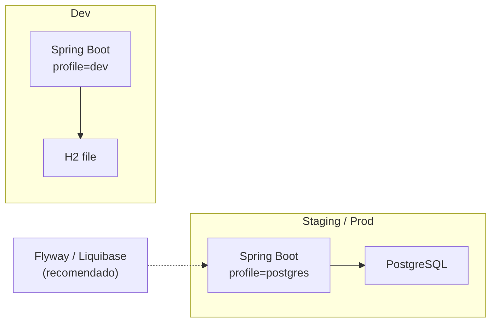
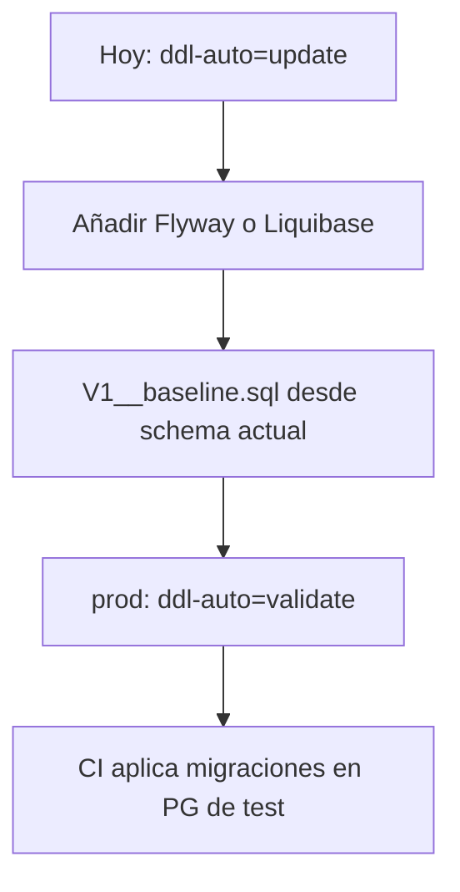

# Migrar de H2 a PostgreSQL

Guía práctica para pasar GymPlatform de **H2 file (dev)** a **PostgreSQL**. El driver ya está en `backend/pom.xml`; falta perfil, datasource y disciplina de migraciones.

---

## Por qué migrar

| H2 (actual) | PostgreSQL (objetivo) |
|-------------|------------------------|
| Ideal para demos locales | Producción, concurrencia, backups |
| SQL “casi” estándar; detalles distintos | Estándar de industria |
| Un archivo `./data/gymdb*` | Servidor gestionado (Docker, RDS, etc.) |
| `ddl-auto=update` cómodo | En prod: esquema versionado + `validate` |

---

## Arquitectura objetivo



---

## Estado actual del proyecto

- Datasource por defecto: `jdbc:h2:file:./data/gymdb;...` en `application.properties`.
- `spring.jpa.hibernate.ddl-auto=update`.
- Seeds demo: scripts H2 (`DATEADD`, `SET REFERENTIAL_INTEGRITY`, etc.) en `classpath:db/demo-seed*.sql`.
- **No hay** aún `application-postgres.properties` activo ni Flyway/Liquibase.

---

## Paso 1 — Levantar PostgreSQL

### Opción A: Docker (recomendada)

```bash
docker run --name gymplatform-pg \
  -e POSTGRES_DB=gymplatform \
  -e POSTGRES_USER=gym \
  -e POSTGRES_PASSWORD=gymsecret \
  -p 5432:5432 \
  -d postgres:16
```

### Opción B: instalación local

Crear DB `gymplatform` y usuario con permisos DDL/DML.

---

## Paso 2 — Perfil Spring `postgres`

Crear `backend/src/main/resources/application-postgres.properties` (no commitear passwords reales; usar env vars):

```properties
# Activar con: --spring.profiles.active=postgres
spring.datasource.url=jdbc:postgresql://localhost:5432/gymplatform
spring.datasource.username=${DB_USER:gym}
spring.datasource.password=${DB_PASSWORD:gymsecret}
spring.datasource.driver-class-name=org.postgresql.Driver

spring.jpa.database-platform=org.hibernate.dialect.PostgreSQLDialect
spring.jpa.hibernate.ddl-auto=update
# En producción real: validate + migraciones versionadas
# spring.jpa.hibernate.ddl-auto=validate

spring.h2.console.enabled=false
```

Arranque:

```bash
cd backend
mvn spring-boot:run -Dspring-boot.run.arguments=--spring.profiles.active=postgres
```

O:

```bash
export SPRING_PROFILES_ACTIVE=postgres
export DB_USER=gym
export DB_PASSWORD=gymsecret
mvn spring-boot:run
```

Con `ddl-auto=update`, Hibernate crea/actualiza tablas en PG vacío.

---

## Paso 3 — Seeds demo (cuidado con SQL H2)

Los scripts en `db/demo-seed*.sql` usan funciones **H2** (`DATEADD`, `SET REFERENTIAL_INTEGRITY`, etc.). En PostgreSQL fallarán tal cual.

Opciones:

| Enfoque | Pros | Contras |
|---------|------|---------|
| **A.** Adaptar scripts a SQL PG (`CURRENT_DATE + INTERVAL '1 day'`, sin `REFERENTIAL_INTEGRITY`) | Seeds iguales en ambos motores | Mantener 2 dialectos o SQL portable |
| **B.** Desactivar `DemoSqlSeeder` en profile `postgres` y cargar datos con un seeder Java / Flyway | Control fino | Más trabajo inicial |
| **C.** Solo schema en PG; datos vía API / import | Simple para staging | Sin demo automática |

Recomendación corto plazo: **B o C** para el primer entorno PG; **A** cuando quieras demos idénticas.

Para desactivar seeds en postgres, condicionar `DemoSqlSeeder` con:

```java
@Profile("!postgres") // o @ConditionalOnProperty
```

(o `app.demo-seed.enabled=false` en el profile).

---

## Paso 4 — Diferencias SQL a vigilar

| Tema | H2 | PostgreSQL |
|------|----|------------|
| Sumar fechas | `DATEADD('DAY', 1, CURRENT_DATE)` | `CURRENT_DATE + INTERVAL '1 day'` |
| Booleans | a veces `TRUE`/`FALSE` | idem (OK) |
| Strings / encoding | UTF-8 OK | UTF-8 OK; revisar collation |
| `IDENTITY` | compatible | `GENERATED BY DEFAULT AS IDENTITY` / serial |
| Case de identificadores | flexible | sin comillas → lowercase |
| JSON | string columns | opcional `jsonb` (mejora futura) |

El código Java (JPA) es en general **portable**; el riesgo está en SQL nativo, seeds y queries `@Query` nativas.

Buscar en el repo:

```bash
rg "DATEADD|REFERENTIAL_INTEGRITY|nativeQuery|jdbcTemplate" backend/
```

---

## Paso 5 — Migración de datos existentes (H2 → PG)

Si ya tienes datos valiosos en `./data/gymdb.mv.db`:

### Camino práctico (recomendado para MVP)

1. Exportar lo crítico por **API** o scripts (orgs, users, productos).
2. Arrancar PG limpio con Hibernate/`update`.
3. Reimportar.

### Camino “dump”

1. Usar herramientas H2 para exportar CSV/SQL.
2. Transformar SQL a dialecto PG.
3. Importar con `psql`.

No hay pipeline automático en el repo todavía; documentar el procedimiento del equipo cuando se estabilice.

---

## Paso 6 — Dejar de usar `ddl-auto=update` en prod



Checklist:

- [ ] Dependencia Flyway (o Liquibase) en `pom.xml`
- [ ] Baseline del esquema actual
- [ ] Profile `prod`: `ddl-auto=validate`, migraciones on
- [ ] Testcontainers PostgreSQL en tests de integración

---

## Paso 7 — Checklist de verificación post-migración

1. Login: `admin@fitlife.com` / cuentas demo (si seeds).
2. CRUD usuarios, actividades, POS (venta + caja).
3. Estadísticas (área privada).
4. WhatsApp settings (secretos cifrados siguen en columnas; misma `app.secrets.encryption-key` o reconfigurar).
5. Uploads: `app.uploads.dir` sigue siendo filesystem (independiente de PG).
6. Formularios públicos y links (`app.public-base-url`).
7. Swagger: `/v3/api-docs` OK.

---

## Variables de entorno sugeridas (prod)

| Variable | Uso |
|----------|-----|
| `SPRING_PROFILES_ACTIVE` | `postgres` / `prod` |
| `DB_USER` / `DB_PASSWORD` / `DB_URL` | JDBC |
| `APP_JWT_SECRET` | (mapear a `app.jwt.secret`) |
| `APP_SECRETS_ENCRYPTION_KEY` | cifrado en reposo |
| `APP_PUBLIC_BASE_URL` | links públicos |
| `APP_CORS_ALLOWED_ORIGINS` | orígenes front |

Ejemplo de binding en properties:

```properties
app.jwt.secret=${APP_JWT_SECRET}
app.public-base-url=${APP_PUBLIC_BASE_URL:http://localhost:5173}
```

---

## Mejoras relacionadas (después de migrar)

1. Connection pool tuning (`hikari.*`).
2. Índices explícitos en FKs calientes (`organization_id`, fechas de agenda).
3. Backups automatizados de PG.
4. Separar DB de demos vs DB de staging.
5. Tests con **Testcontainers** para no depender de H2 en CI (H2 puede ocultar bugs de PG).

---

## Resumen rápido

1. Docker Postgres 16.
2. Profile `postgres` + JDBC URL.
3. Arrancar con schema vacío → Hibernate crea tablas.
4. Adaptar o desactivar seeds H2.
5. Validar flujos críticos.
6. Planear Flyway + `validate` antes de producción real.
