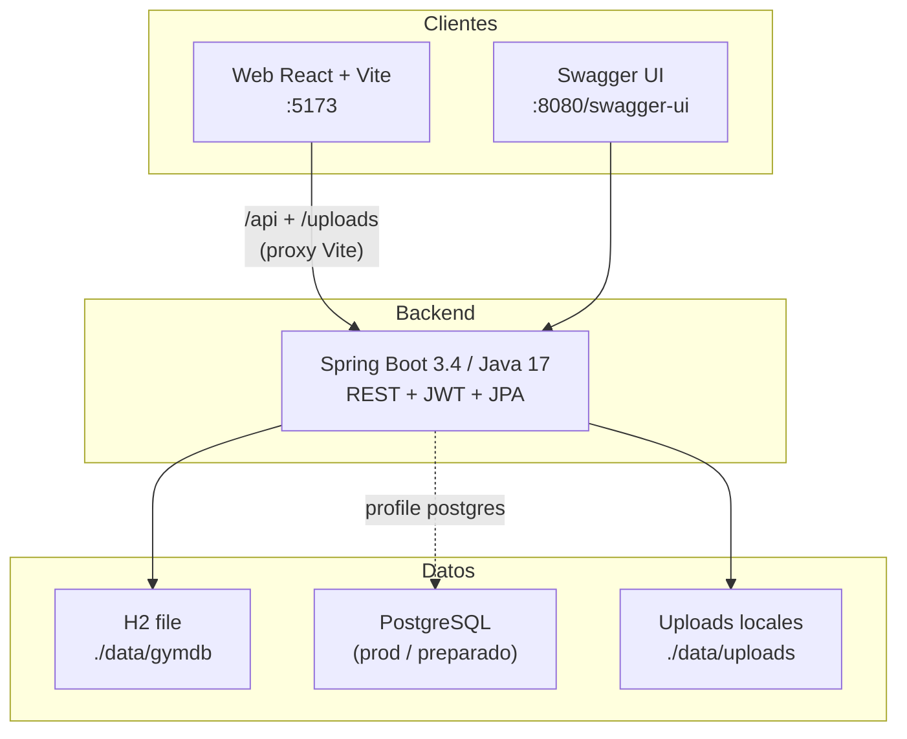
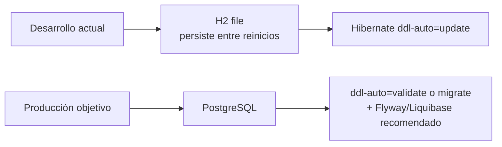
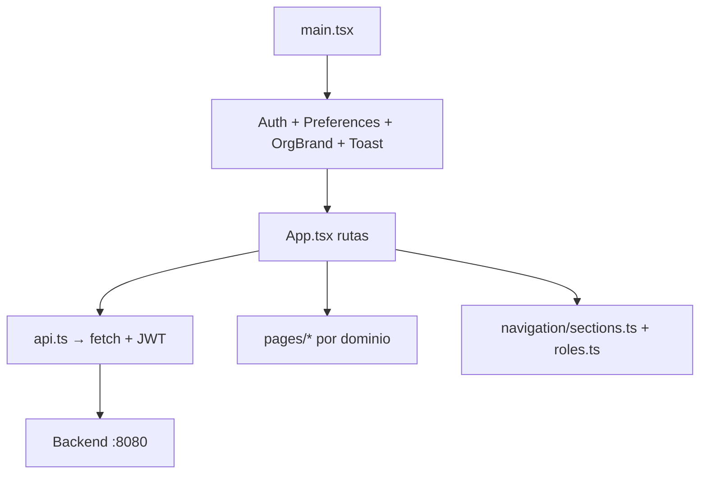

# Stack tecnológico

Documentación del stack actual de **GymPlatform** (API, base de datos, web y herramientas). Pensada para onboarding, testing e improvements.

> Relacionado: [Arquitectura](Architecture) · [ERD](Database-ERD) · [Migrar a PostgreSQL](Migrate-H2-to-PostgreSQL) · [Frontend](Frontend)

---

## Visión en una frase

SaaS **multi-tenant** para gimnasios: un backend REST con JWT y un panel web React; en desarrollo la DB es **H2 en archivo**, lista para **PostgreSQL** en producción.

---

## Diagrama de contexto



---

## Capas y versiones

| Capa | Tecnología | Versión / notas | Puerto / ruta |
|------|------------|-----------------|---------------|
| **API** | Spring Boot | **3.4.1** (parent) | `8080` |
| | Java | **17** | — |
| | Spring Web / Security / Validation / Data JPA | starters Boot | `/api/**` |
| | JWT (JJWT) | **0.12.6** | header `Authorization: Bearer` |
| | OpenAPI (springdoc) | **2.8.3** | `/swagger-ui.html`, `/v3/api-docs` |
| | DevTools | opcional | hot reload |
| **DB dev** | H2 (file) | runtime | `jdbc:h2:file:./data/gymdb` · consola `/h2-console` |
| **DB prod** | PostgreSQL driver | en `pom.xml`, sin profile activo aún | ver [migración](Migrate-H2-to-PostgreSQL) |
| **ORM** | Hibernate via Spring Data JPA | `ddl-auto=update` | esquema evolutivo |
| **Web** | React | **19** | `5173` |
| | TypeScript | **~5.7** | — |
| | Vite | **6** | proxy `/api`, `/uploads` → `:8080` |
| | React Router | **7** | SPA |
| | Recharts | **3** | estadísticas |
| | jsPDF | **4** | PDFs (facturas, expedientes, QR) |
| | @dnd-kit | **6 / 10** | drag & drop (formularios / UI) |
| **Docs** | Markdown wiki + Notion hub + sync scripts | Node | `npm run docs:sync:*` |

---

## Backend (API) — detalle

### Estilo de diseño

```
Controller  →  Service (@Transactional)  →  Repository (JPA)  →  Entity
     ↓
  DTO (records) + excepciones de negocio → JSON en español
```

| Paquete / área | Responsabilidad |
|----------------|-----------------|
| `controller` | HTTP, roles vía Security |
| `service` | Reglas de negocio |
| `repository` | Spring Data JPA |
| `domain.entity` / `enums` | Modelo persistente (~42 entidades) |
| `dto` | Contratos de entrada/salida (records) |
| `config` | Security, CORS, seeders demo (`DemoSqlSeeder`) |
| `util` | JWT, WhatsApp, teléfonos CR, recurrencia de actividades |

### Seguridad

- Spring Security + filtro JWT.
- Claims: usuario, roles, `organizationId` (gimnasio).
- `/api/platform/**` deshabilitado (producto = un gimnasio).
- Secretos sensibles (p. ej. WhatsApp Cloud API) cifrados en reposo (`app.secrets.*`).

### Integraciones / features transversales

| Feature | Cómo |
|---------|------|
| WhatsApp | `wa.me` o Cloud API (configurable por gym) |
| Formularios públicos | URL `/f/{orgSlug}/{formSlug}` (front) |
| Uploads mercadeo | filesystem `./data/uploads` servido por API |
| Demo data | SQL en `classpath:db/demo-seed*.sql` al arrancar |

### Configuración clave (`application.properties`)

- Datasource H2 file + `spring.jpa.hibernate.ddl-auto=update`
- JWT: `app.jwt.secret`, `app.jwt.expiration-ms` (24 h)
- CORS orígenes locales Vite/CRA
- `app.public-base-url` para links de formularios / WhatsApp

---

## Base de datos



| Aspecto | Estado actual |
|---------|---------------|
| Motor | H2 **file** (no solo in-memory): `./data/gymdb` |
| Esquema | Generado/actualizado por Hibernate |
| Seeds | `demo-seed.sql`, `demo-seed-sales.sql`, `demo-seed-member.sql`, `demo-seed-member-staff.sql` |
| Multi-tenant | Columna / FK `organization_id` en casi todas las tablas de negocio |
| ERD | [Database-ERD](Database-ERD) |

---

## Frontend web — resumen

Ver detalle completo en **[Frontend](Frontend)**.



| Concepto | Archivo / patrón |
|----------|------------------|
| Cliente HTTP | `web/src/api.ts` |
| Tipos | `web/src/types.ts` |
| Auth + rol activo | `web/src/auth.tsx` + `localStorage` |
| Rutas por rol | `App.tsx` + `roles.ts` + `navigation/sections.ts` |
| Estilos | CSS global `index.css` + variables de tema / marca del gym |

---

## Tooling y calidad

| Área | Herramienta |
|------|-------------|
| Build API | Maven (`mvn spring-boot:run`) |
| Build web | `npm run dev` / `npm run build` |
| API docs | Swagger + scripts `docs:export-openapi` / `docs:update-api` |
| Wiki / Notion | `npm run docs:sync:fast` \| `docs:sync:full` |
| Tests | Spring Test + Security Test (backend); web sin suite formal aún |

---

## Mejoras naturales (roadmap técnico)

Prioridades razonables antes/durante testing serio:

1. **PostgreSQL + migraciones versionadas** (Flyway/Liquibase) — dejar de depender de `ddl-auto=update`.
2. **Tests** — API (MockMvc / Testcontainers PG), contratos OpenAPI, smoke E2E web.
3. **Perfiles Spring** (`dev` / `postgres` / `prod`) y secretos fuera del repo.
4. **CI** — build + tests en push; no solo sync de docs.
5. **Observabilidad** — logs estructurados, health checks, métricas.
6. **Frontend** — tests de componentes/rutas críticas; tipado estricto de errores API.

---

## Mapa de documentación

| Doc | Contenido |
|-----|-----------|
| [Architecture](Architecture) | Multi-tenant, auth, capas |
| [Database-ERD](Database-ERD) | Modelo de datos (diagramas) |
| [Migrate-H2-to-PostgreSQL](Migrate-H2-to-PostgreSQL) | Pasos de migración |
| [Frontend](Frontend) | Estructura React, rutas, patrones |
| [API-Reference](API-Reference) + Swagger | Endpoints |
| [Testing-Guide](Testing-Guide) | Checklists funcionales por rol |
| [Roles-and-Permissions](Roles-and-Permissions) | Matriz de acceso |
